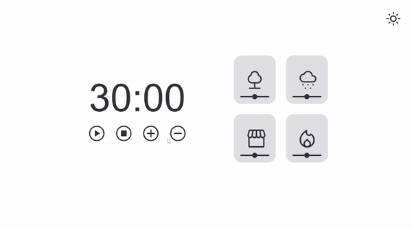

# FocusTimer - Dark Mode

### 💡 Sobre o projeto
O Focus Timer - Dark Mode é uma aplicação baseada na técnica Pomodoro, desenvolvida para auxiliar na produtividade e gerenciamento de tempo. Com recursos visuais modernos, modos claro/escuro, sons ambientes e controle de volume, a experiência do usuário é intuitiva e agradável.

## 🎯 Funcionalidades
- ⏱ Temporizador com contagem regressiva

- 🌗 Alternância entre tema claro e escuro

- 🔊 Sons ambientes (floresta, chuva, cafeteria, lareira)

- 🎚 Controle de volume individual para cada som

- 💫 Animações e transições suaves

## 🛠 Tecnologias utilizadas
- HTML5

- CSS3

- JavaScript (Vanilla)

## 🎨 Layout
O design foi inspirado em práticas modernas de UI/UX, com foco em acessibilidade e minimalismo.

## 📸 Demonstração

 

## 👨‍💻 Autor
Feito com 💙 por Cleyton Melo
